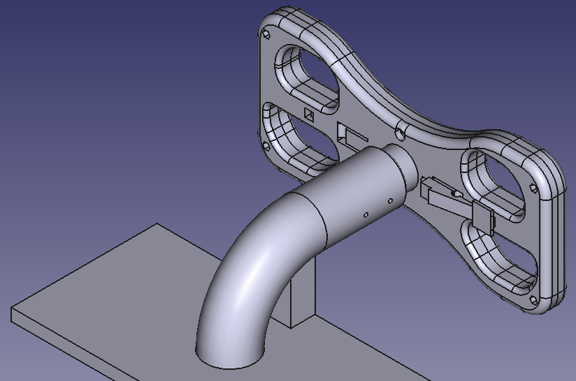
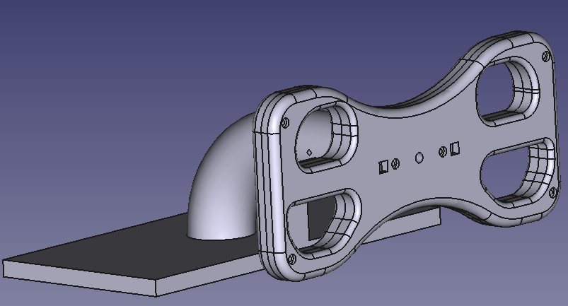
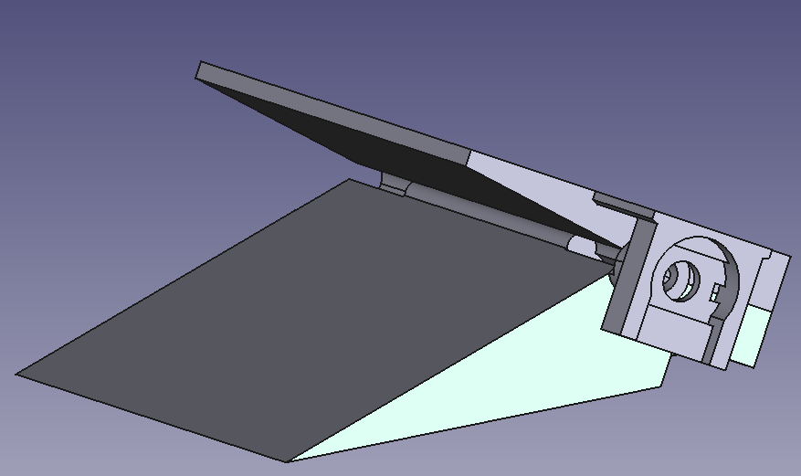

# STEERING F-UNO: SERIAL STEERING WHEEL
This Project is a simple (easy & cheap) Steering Wheel Joystick using **Arduino UNO** (no support for USB protocol).

## Introduction

The idea was to have a minimal (easy and cheap) Game Steering Wheel mainly to play
(on Linux) [Geoff Crammond's Grand Prix 4](https://www.myabandonware.com/game/grand-prix-4-dwu).
The steering wheel and pedals are based on three potentiometers that are used to
encode their postition and angle.
For the comunication with the computer it uses (for now) an **Arduino UNO**, so only
the a serial comunication is available.

The Game Steering Wheel consists of three main parts:
* steering wheel
* throttle and break pedals
* python driver

In what follow we are going to describe them in detail.
 
## Components

[FreeCAD](https://www.freecad.org/) has been used to design the The Steering Wheel 3D model.

 

The _FCStd_ file is in the directoy `./3Dprinter/freeCAD_models`

--- 

#### TODO

* [ ] electronics
    * [ ] potentiometer
    * [ ] buttons
    * [ ] connections
* [ ] mechanics
    * [ ] steering wheel
    * [ ] pedal
* [ ] sofware
    * [ ] python driver (based on `vgamepad`)
    * [ ] calibration
    * [ ] arduino code
* [ ] tests