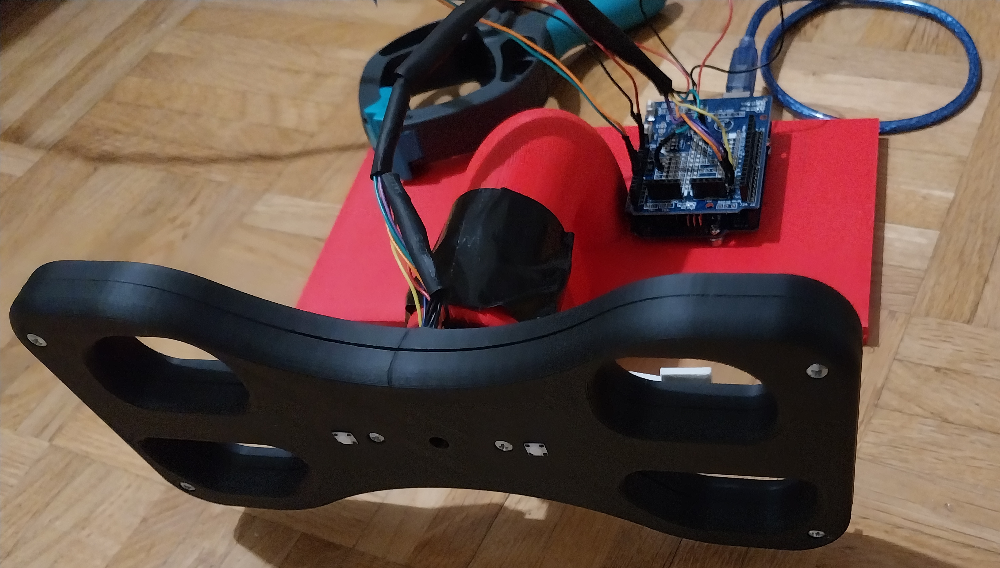
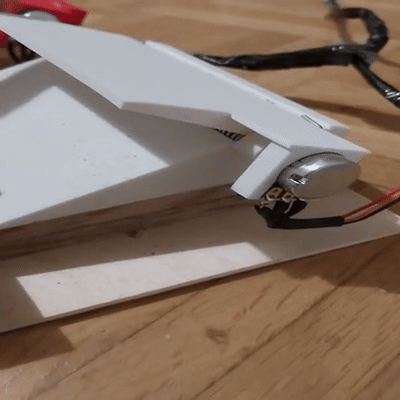
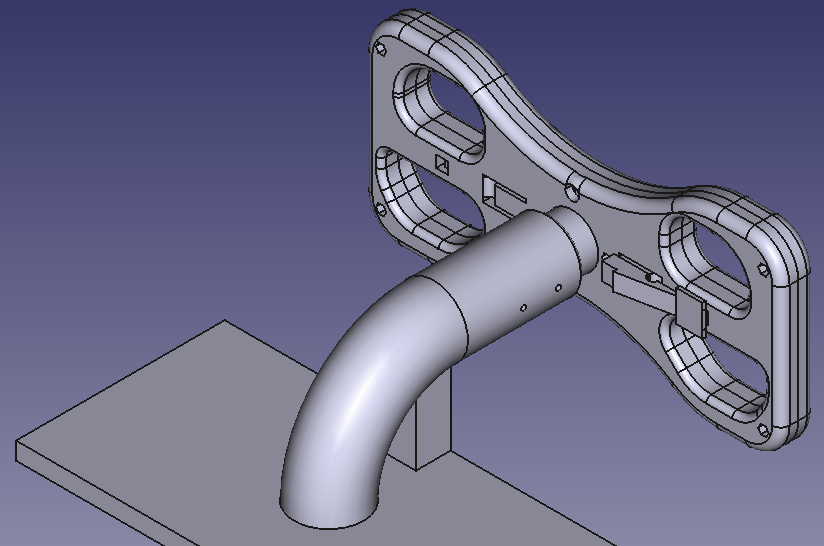
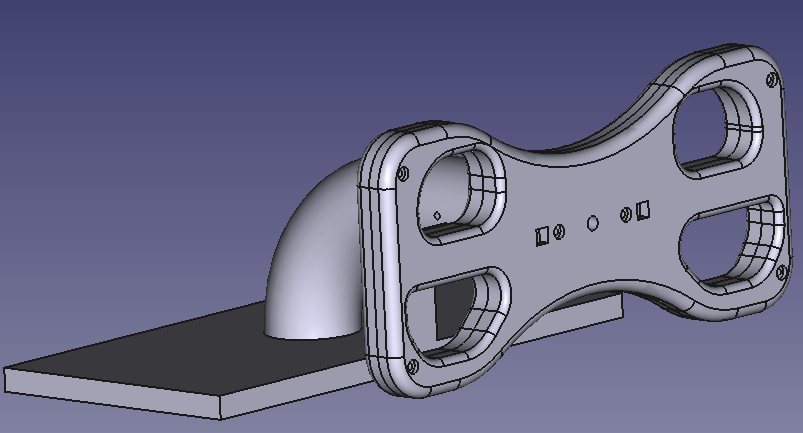
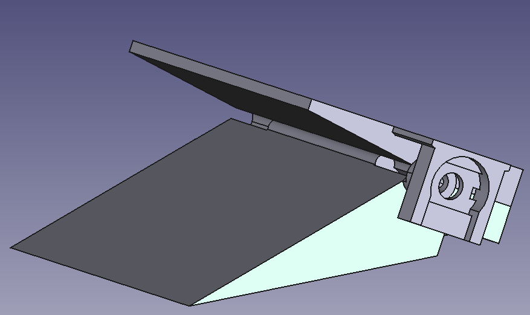
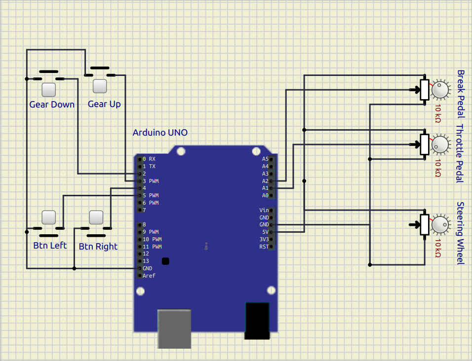

# STEERING F-UNO: SERIAL STEERING WHEEL
This Project is a simple (easy & cheap) Steering Wheel Joystick using **Arduino UNO** (no support for USB protocol).

## Introduction

The idea was to have a minimal (easy and cheap) Game Steering Wheel mainly to play
(on Linux) [Geoff Crammond's Grand Prix 4](https://www.myabandonware.com/game/grand-prix-4-dwu).
The steering wheel and pedals are based on three potentiometers that are used to
encode their postition and angle.
For the comunication with the computer it uses (for now) an **Arduino UNO**, so only
the a serial comunication is available: to simulate a joystick the library [vgamepad](https://pypi.org/project/vgamepad/) is used.

The Game Steering Wheel consists of three main parts:
* steering wheel
* throttle and break pedals
* python driver

 

 

In what follow we are going to describe them in detail.
 
## Components

### Material

#### Steering Wheel and Pedals

For the steering wheel and the pedal, you need to print the models:

* [FreeCAD](https://www.freecad.org/) has been used to design the The Steering Wheel 3D model.

 

* The _FCStd_ file is in the directoy `./3Dprinter/freeCAD_models`

In order to assemble it, one needs:
* 6 screw `M3x20mm` with a exagonal nut of `6mm`
* 6 springs from clothespin: they are used for the gear (2) and the pedals ( 2 for each)

#### Electronic coomponents
The electronic component consists of only few parts
* Arduino UNO
* 2 potentiometer [Alpha RV16AF-20-15K-B10K RV16AF20KB10KM](https://www.conrad.de/de/p/alpha-rv16af-20-15k-b10k-rv16af20kb10km-dreh-potentiometer-mono-200-mw-10-k-1-st-1694304.html?gid=371931&mid=11354&awinaffid=515769&linkid=3411712&utm_source=awin&utm_medium=cpo&utm_content=css&utm_campaign=515769&gad_source=1&gad_campaignid=22426608696&gclid=EAIaIQobChMI7v2trObsjQMV4ZeDBx2Azi2ZEAQYASABEgIFpfD_BwE&refresh=true) for the pedals
      _NOTE_: If you use another type of potentiometer, you need to redesign the pedals
* 1 potentiometer [Weltron 002045038792 WP20CS-08-60F1-10K-20%-LIN](https://www.conrad.de/de/p/weltron-002045038792-wp20cs-08-60f1-10k-20-lin-dreh-potentiometer-mono-0-4-w-10-k-1-st-440891.html) for the steering wheel
* At least 2 buttons [C-TS695 TC-TS695](https://www.conrad.de/de/p/tru-components-tc-ts695-tc-ts695-drucktaster-12-v-dc-tastend-1-st-1589390.html?gid=371931&mid=11354&awinaffid=515769&linkid=3411712&utm_source=awin&utm_medium=cpo&utm_content=css&utm_campaign=515769&gad_source=1&gad_campaignid=22426608696&gclid=EAIaIQobChMI0MWul-jsjQMV752DBx3yMi1FEAQYBSABEgKPOPD_BwE) for the gear up, gear down.
There are two optional buttons.
      _NOTE_: If you use another type of buttons, you need to redesign the holes for them
* wires

### Cicuit

The cicuit is extremly simple:

* schema and simulation done with [slimul IDE](https://simulide.com/p/) (`simulator/joystick.sim1`)

It consists of just few parts:
* 4 buttons
    * 2 buttons are used to control the gears (UP/DOWN)
    * 2 buttons can be customize
* 3 potentiometers
    * 2 are for the pedals
    * 1 to decode the rotation of the steering wheel
* [Arduino UNO](https://docs.arduino.cc/hardware/uno-rev3/): for the Arduino code see section **Software: Arduino**

### Software

The software consists of two main parts: Arduino and python driver.

#### Arduino

The [arduino sketch](./joystarduino/joystarduino.ino) is extremly simple: it just read the input from the
different pins where potentiometers and buttons are connected and serialize them
to the python driver via the serial port: it is just `;`-separated line of the
different values in a specific order.
There are two type of messages:
* **version 1** consist of only 5 values:

|Position | Component          |  Type   | pin                |
|:-------:|:-------------------|:-------:|-------------------:|
|1        | steering wheel     | analog  | `PIN_WHEEL_INPUT`  |
|2        | break pedal        | analog  | `PIN_BREAK_INPUT`  |
|3        | throttle pedal     | analog  | `PIN_GAS_INPUT`    |
|4        | right back button  | digital | `PIN_BTN_GEAR_UP`  |
|5        | left back button   | digital | `PIN_BTN_GEAR_DOWN`|

* **version 2** (`#define VERSION  2`) consist of 2 extra-values:

|Position | Component          |  Type   | pin                |
|:-------:|:-------------------|:-------:|-------------------:|
|1        | steering wheel     | analog  | `PIN_WHEEL_INPUT`  |
|2        | break pedal        | analog  | `PIN_BREAK_INPUT`  |
|3        | throttle pedal     | analog  | `PIN_GAS_INPUT`    |
|4        | right back button  | digital | `PIN_BTN_GEAR_UP`  |
|5        | left back button   | digital | `PIN_BTN_GEAR_DOWN`|
|6        | left front button  | digital | `PIN_BTN_LEFT`     |
|7        | right front button | digital | `PIN_BTN_RIGHT`    |

**NOTE:**  that the Button are initilized in the `pinMode` `INPUT_PULLUP`, so a button press is read as a `LOW` signal, while the button not being pressed is read as `HIGH`.

#### Python Driver

The python driver has 3 component:
* the [runner](virtual_steering_wheel/joystick/runner.py): it identifies the message version and create the corresponding `VirtualJoystic<...>`-object
* The [VirtualJoysticks](virtual_steering_wheel/joystick/vjoy.py):
   * `VirtualJoysticSimple`: minimal joystick with two button (message **version 1**)
   * `VirtualJoysticGP4`: joystick with 4 button (message **version 2**) - the 
        On linux only `GAMEPAD_A` and `GAMEPAD_B` seems to be working: 
        in GP4 keys `x`, `c` are used to look left/right: This joystick simulates these key press with the 2 extra buttons with help of the library `pyautogui`.
* The [ArduinoStateVn](virtual_steering_wheel/joystick/arduino_state.py) store the input from arduino and update the state of the joystick depending of the message version `ArduinoStateV1`, `ArduinoStateV2`

##### Calibration

In order to properly map the values of the potentiometer to proper ranges, the `serial joystick` needs to be calibrated. 

At the end of the calibation the ranges can be saved into a file (default is `os.path.expanduser('~/.joystic_configuration')`)